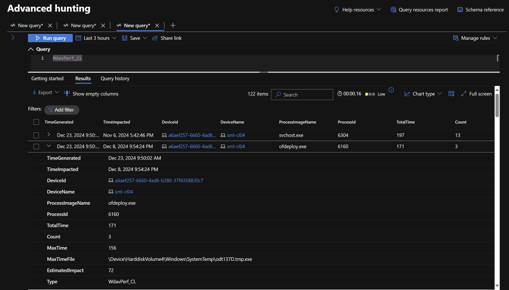

# Defender AV Performance Monitoring and Tuning



This will eventually contain some more guidance, but for now, I'm focusing on telemetry collection ;)

For performance analysis and exclusion guidance, check the following Microsoft docs:

[Performance analyzer for Microsoft Defender Antivirus](https://learn.microsoft.com/en-us/defender-endpoint/tune-performance-defender-antivirus)

[Troubleshoot performance issues related to real-time protection](https://learn.microsoft.com/en-us/defender-endpoint/troubleshoot-performance-issues)

[Common mistakes to avoid when defining exclusions](https://learn.microsoft.com/en-us/defender-endpoint/common-exclusion-mistakes-microsoft-defender-antivirus)

[Configure custom exclusions for Microsoft Defender Antivirus](https://learn.microsoft.com/en-us/defender-endpoint/configure-exclusions-microsoft-defender-antivirus)

[Contextual file and folder exclusions](https://learn.microsoft.com/en-us/defender-endpoint/configure-contextual-file-folder-exclusions-microsoft-defender-antivirus)

## Uploading to Log Analytics

This guide is based on the following article: [https://learn.microsoft.com/en-us/azure/azure-monitor/logs/tutorial-logs-ingestion-api?tabs=dcr](https://learn.microsoft.com/en-us/azure/azure-monitor/logs/tutorial-logs-ingestion-api?tabs=dcr)

I will condense these articles to only what we need later, but for now, I'm just going to link to the parts of the articel you need to follow for each of the steps.

### Create the Entra app registration

We simply create an app registration and add a secret or cert, then record the appId, tenantId, and secret or cert thumbprint.

[https://learn.microsoft.com/en-us/azure/azure-monitor/logs/tutorial-logs-ingestion-api?tabs=dcr#create-microsoft-entra-application](https://learn.microsoft.com/en-us/azure/azure-monitor/logs/tutorial-logs-ingestion-api?tabs=dcr#create-microsoft-entra-application)

### Create custom table in Log Analytics

You could choose to create this table in the Azure portal, but the below works well from Azure Cloud Shell if you want. The key is to create a table with _CL at the end, and the columns must match from the table below.

The workspace resource ID below can be found by following this: [https://learn.microsoft.com/en-us/azure/azure-monitor/logs/tutorial-logs-ingestion-api?tabs=dcr#collect-workspace-details](https://learn.microsoft.com/en-us/azure/azure-monitor/logs/tutorial-logs-ingestion-api?tabs=dcr#collect-workspace-details)

```powershell
# Define Log Analytics Workspace
$workspace = "/subscriptions/96e4534f-1815-4eaf-9420-4d612d2aaf3f/resourcegroups/sentinel-sml-westus2/providers/microsoft.operationalinsights/workspaces/sentinel-sml-westus2"

# Define custom table to create
$tableParams = @'
{
    "properties": {
        "schema": {
            "name": "MdavPerf_CL",
            "columns": [
                { "name": "TimeGenerated", "type": "datetime", "description": "" },
                { "name": "TimeImpacted", "type": "datetime", "description": "" },
                { "name": "DeviceId", "type": "string", "description": "" },
                { "name": "DeviceName",  "type": "string", "description": "" },
                { "name": "ProcessImageName", "type": "string", "description": "" },
                { "name": "ProcessId", "type": "int", "description": "" },
                { "name": "TotalTime", "type": "int", "description": "" },
                { "name": "Count", "type": "int", "description": "" },
                { "name": "MaxTime", "type": "int", "description": "" },
                { "name": "MaxTimeFile", "type": "string", "description": "" },
                { "name": "EstimatedImpact", "type": "int", "description": "" }
            ]
        }
    }
}
'@

# Create the table
Invoke-AzRestMethod -Method PUT -Path "$workspace/tables/MdavPerf_CL?api-version=2022-10-01" -Payload $tableParams
```

### Create the Data Collection Rule

Now we need to create the Data Collection Rule to using a custom template. This avoids having to create and configure a Data Collection Endpoint and sets us up better for the future :)

Here's the docs, but be sure to use the template from below and not the one from the docs: [https://learn.microsoft.com/en-us/azure/azure-monitor/logs/tutorial-logs-ingestion-api?tabs=dcr#create-data-collection-rule](https://learn.microsoft.com/en-us/azure/azure-monitor/logs/tutorial-logs-ingestion-api?tabs=dcr#create-data-collection-rule)


```
{
    "$schema": "https://schema.management.azure.com/schemas/2019-08-01/deploymentTemplate.json#",
    "contentVersion": "1.0.0.0",
    "parameters": {
        "dataCollectionRuleName": {
            "type": "string",
            "metadata": {
                "description": "Specifies the name of the Data Collection Rule to create."
            }
        },
        "location": {
            "type": "string",
            "metadata": {
                "description": "Specifies the location in which to create the Data Collection Rule."
            }
        },
        "workspaceResourceId": {
            "type": "string",
            "metadata": {
                "description": "Specifies the Azure resource ID of the Log Analytics workspace to use."
            }
        }
    },
    "resources": [
        {
            "type": "Microsoft.Insights/dataCollectionRules",
            "name": "[parameters('dataCollectionRuleName')]",
            "location": "[parameters('location')]",
            "apiVersion": "2023-03-11",
            "kind": "Direct",
            "properties": {
                "streamDeclarations": {
                    "Custom-MdavPerfData": {
                        "columns": [
                            { "name": "Timestamp", "type": "string" },
                            { "name": "DeviceId", "type": "string" },
                            { "name": "DeviceName",  "type": "string" },
                            { "name": "ProcessImageName", "type": "string" },
                            { "name": "ProcessId", "type": "int" },
                            { "name": "TotalTime", "type": "int" },
                            { "name": "Count", "type": "int" },
                            { "name": "MaxTime", "type": "int" },
                            { "name": "MaxTimeFile", "type": "string" },
                            { "name": "EstimatedImpact", "type": "int" }
                        ]
                    }
                },
                "destinations": {
                    "logAnalytics": [
                        {
                            "workspaceResourceId": "[parameters('workspaceResourceId')]",
                            "name": "sentinel-sml-westus2"
                        }
                    ]
                },
                "dataFlows": [
                    {
                        "streams": [
                            "Custom-MdavPerfData"
                        ],
                        "destinations": [
                            "sentinel-sml-westus2"
                        ],
                        "transformKql": "source | project TimeGenerated = todatetime(Timestamp), TimeImpacted = todatetime(Timestamp), DeviceId, DeviceName, ProcessImageName, ProcessId, TotalTime, Count, MaxTime, MaxTimeFile, EstimatedImpact",
                        "outputStream": "Custom-MdavPerf_CL"
                    }
                ]
            }
        }
    ],
    "outputs": {
        "dataCollectionRuleId": {
            "type": "string",
            "value": "[resourceId('Microsoft.Insights/dataCollectionRules', parameters('dataCollectionRuleName'))]"
        }
    }
}
```

### Send test data

The final step is to ingest data and make sure it all works. Update the variables in this script with details for your tenant, and run it on an endpoint from an Admin PowerShell (tested working with both v5 and v7): [upload-logs-to-log-analytics.ps1](upload-logs-to-log-analytics.ps1)

If you have questions, ping me on social media. I'll get back to this after holidays to provide better directions ;)
