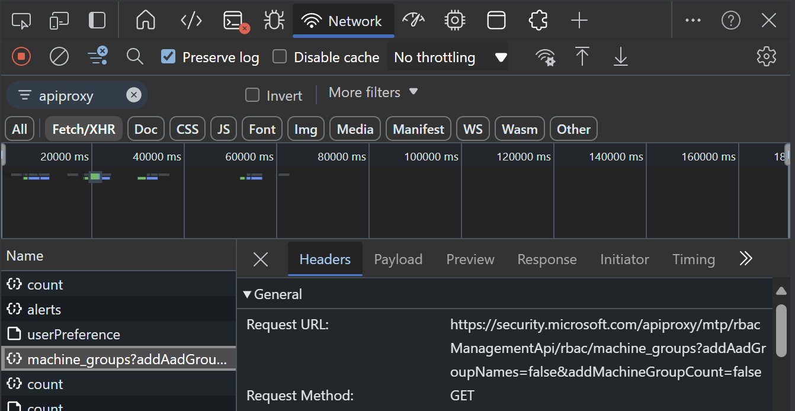
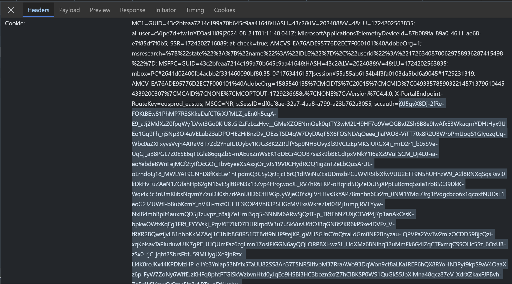

# Automated Configuration

This is a collection of commands that will help automate the configuration of the Defender XDR portal settings. To use this, you must obtain the sccauth value and xsrf-token value from the browser and use it to create cookies and headers for our API calls. This is because we are using an internal API to configure settings, and there isn't a public way to get the right tokens.

## Table of Contents

[Setting up our session and cookies](README.md#setting-up-our-session-and-cookies)

[Email notifications](README.md#email-notifications)

[Preview features](README.md#preview-features)

[Alert service settings](README.md#alert-service-settings)

[Permissions and Roles](README.md#permissions-and-roles)

[Streaming API](README.md#streaming-api)

[Asset rule management](README.md#asset-rule-management)

[Alert tuning](README.md#alert-tuning)

[Critical asset management](README.md#critical-asset-management)

[Identity automated response](README.md#identity-automated-response)

## Setting up our session and cookies

First, we need to create a WebRequestSession object contaning the sccauth and xsrf cookies copied from the browser and headers with the xsrf token. To get this, open Developer Tools in your browser and make sure the Network tab is set to preserve logs, then log into security.microsoft.com. Search for **apiproxy** and select a request.



Under headers, scroll down under the cookies section, copy the value after sccauth (it is very long) all the way to the next semicolon and save it into the $sccauth variable. Now do the same for xsrf-token and save it into the $xsrf variable.



Now we can create a session with that cookie:

```powershell
# Create session to store cookies in
$session = New-Object Microsoft.PowerShell.Commands.WebRequestSession

# Copy sccauth from the browser
$sccauth = Get-Clipboard
$session.Cookies.Add((New-Object System.Net.Cookie("sccauth", "$sccauth", "/", "security.microsoft.com")))

# Copy xsrf token from the browser
$xsrf = Get-Clipboard
$session.Cookies.Add((New-Object System.Net.Cookie("XSRF-TOKEN", "$xsrf", "/", "security.microsoft.com")))

# Set the headers to include the xsrf token
[Hashtable]$Headers=@{}
$headers["X-XSRF-TOKEN"] = [System.Net.WebUtility]::UrlDecode($session.cookies.GetCookies("https://security.microsoft.com")['xsrf-token'].Value)

```

With this complete, we can now make requests to the internal API :)

This is an example that returns the tenant context for the whole Defender portal and feature set:

```powershell
Invoke-RestMethod -Uri "https://security.microsoft.com/apiproxy/mtp/sccManagement/mgmt/TenantContext?realTime=true" -ContentType "application/json" -WebSession $session -Headers $headers

```

## Email notifications

Defender XDR email notifications allows us to better manage notifications across all of the services intead of having to create them on each individual service.

The following commands will get the list of notification configurations:

```powershell
# Get existing incident notifications
Invoke-RestMethod -Uri "https://security.microsoft.com/apiproxy/mtp/k8s/cloud/public/internal/IncidentNotificationSettingsV2" -ContentType "application/json" -WebSession $session -Headers $headers

# Get existing actions notifications
Invoke-RestMethod -Uri "https://security.microsoft.com/apiproxy/mtp/actionCenter/actioncenterui/email-notifications" -ContentType "application/json" -WebSession $session -Headers $headers

# Get existing threat analytics notifications
Invoke-RestMethod -Uri "https://security.microsoft.com/apiproxy/mtp/k8s/settings/ThreatAnalyticNotificationsSettings" -ContentType "application/json" -WebSession $session -Headers $headers

```

I will work on adding an example of each for creating new notifications once I've finished documenting these API endpoints.

## Preview features

To get the existing values for Preview features:

```powershell
# Defender XDR and Defender for Identity
Invoke-RestMethod -Uri "https://security.microsoft.com/apiproxy/mtp/settings/GetPreviewExperienceSetting?context=MtpContext" -ContentType "application/json" -WebSession $session -Headers $headers

# Defender for Endpoint
Invoke-RestMethod -Uri "https://security.microsoft.com/apiproxy/mtp/settings/GetPreviewExperienceSetting?context=MdatpContext" -ContentType "application/json" -WebSession $session -Headers $headers


# Defender for Cloud Apps
Invoke-RestMethod -Uri "https://security.microsoft.com/apiproxy/mcas/cas/api/v1/preview_features/get/" -ContentType "application/json" -WebSession $session -Headers $headers

```

The following commands enable Preview features:

```powershell
# Defender XDR and Defender for Identity
Invoke-RestMethod -Method "POST" -Uri "https://security.microsoft.com/apiproxy/mtp/settings/SavePreviewExperienceSetting?context=MtpContext" -Body '{"IsOptIn =true}' -ContentType "application/json" -WebSession $session -Headers $headers

# Defender for Endpoint
Invoke-RestMethod -Method "POST" -Uri "https://security.microsoft.com/apiproxy/mtp/settings/SavePreviewExperienceSetting?context=MdatpContext" -Body '{"IsOptIn =true}' -ContentType "application/json" -WebSession $session -Headers $headers

# Defender for Cloud Apps
Invoke-RestMethod -Method "POST" -Uri "https://security.microsoft.com/apiproxy/mcas/cas/api/v1/preview_features/update/" -Body '{"previewFeaturesEnabled =true}' -ContentType "application/json" -WebSession $session -Headers $headers

```

## Alert service settings

By default, Entra Identity Protection only shares High risk alerts to the Defender XDR service, and none of the Defender for Cloud alerts are shared. 

Most organizations will find more value in using Defender XDR as a unified security platform for all investigation and response, so I recommend enabling all alerts and handling everything in the unified Defender platform.

### Microsoft Entra ID Protection

This body configures to "All alerts" (Recommended):

```powershell
$body = @{
    Feedback = $null
    DisablementType = "None"
} | ConvertTo-Json

```

This body configures to "High-impact alerts only =

```powershell
$body = @{
    Feedback = $null
    DisablementType = "None"
} | ConvertTo-Json

```

This command makes the change:

```powershell
Invoke-RestMethod -Method "PUT" -Uri "https://security.microsoft.com/apiproxy/mtp/alertsApiService/workloads/disabled?workload=Aad" -Body $body -ContentType "application/json" -WebSession $session -Headers $headers

```

### Defender for Cloud

This body configures to "All alerts" (Recommended):

```powershell
$body = @{
    Feedback = $null
    DisablementType = "None"
} | ConvertTo-Json

```

This body configures to "No alerts =

```powershell
$body = @{
    Feedback = $null
    DisablementType = "Full"
} | ConvertTo-Json

```

This command makes the change:

```powershell
Invoke-RestMethod -Method "PUT" -Uri "https://security.microsoft.com/apiproxy/mtp/alertsApiService/workloads/disabled?workload=Mdc"  -Body $body -ContentType "application/json" -WebSession $session -Headers $headers

```

## Permissions and Roles

Unified RBAC is the future of Defender permissions, and we will want to move to this model sooner than later. These commands help check whether Unified RBAC is enabled for the supported services (and show ones that have been added that are not available yet!), and optionally enable Unified RBAC for each of the services that are currently supported. I will try to remember to update this once Defender for Cloud Apps has been made publicly available ;)

```powershell
# Get the current configuration of which services are using Unified RBAC
$headers["api-version"] = "1.0"
(Invoke-RestMethod -Uri "https://security.microsoft.com/apiproxy/mtp/urbacConfiguration/gw/unifiedrbac/configuration/tenantinfo/" -ContentType "application/json" -WebSession $session -Headers $headers).workloads

# Enable Unified RBAC for all workloads
$headers["api-version"] = "2.0"
"Mda","Mde","Mdi","Mdo" | ForEach-Object {
    Invoke-RestMethod -Method "POST" -Uri "https://security.microsoft.com/apiproxy/mtp/urbacConfiguration/gw/unifiedrbac/configuration/enablement/?workload=$_" -ContentType "application/json" -WebSession $session -Headers $headers
}

```

I will provide more examples of creating RBAC roles in the near future. The cmdlet for [New-MgBetaRoleManagementDefenderRoleDefinition](https://learn.microsoft.com/en-us/powershell/module/microsoft.graph.beta.devicemanagement.enrollment/new-mgbetarolemanagementdefenderroledefinition?view=graph-powershell-beta) was recently added, but the API endpoint referenced isn't in the public Graph API docs yet.

Fabian Bader was kind enough to point out the URI which will simply be another RBAC provider (Defender) under the unified role management API:
https://learn.microsoft.com/en-us/graph/api/resources/rolemanagement?view=graph-rest-beta

While we can get and set Unified RBAC roles using Graph API, I haven't found a Graph API endpoint with the permissions quite yet. We can run the following commands get a list of avaialable permissions that you'll use to create roles:

```powershell
# Get list of available permissions
$permissions = (Invoke-RestMethod -Uri "https://security.microsoft.com/apiproxy/mtp/urbacConfiguration/gw/unifiedrbac/configuration/permissions/" -ContentType "application/json" -WebSes

# Show permissions applicable to MDE
$permissions | Where-Object { $_.appScopeIds -contains "Mde" }

```

Here is an example using the new Graph API endpoint to get the existing RBAC roles and their associated permissions:

```powershell
# Get current Defender RBAC roles
(Invoke-MgGraphRequest -Uri "https://graph.microsoft.com/beta/roleManagement/defender/roleDefinitions" -OutputType PSObject).value

# Create the role assigned to a group (be sure to update group objectId or search parameter)
$group = Get-MgGroup -GroupId 'b1d02e79-86f9-4a8a-8b36-ddb35d4c847a'
$body = @{
    displayName = "Read-Only"
    rolePermissions = @(@{
        allowedResourceActions = @("microsoft.xdr/secops/*/read","microsoft.xdr/securityposture/*/read")
    })
    roleAssignments = @(@{
        id = ""
        roleDefinitionId = ""
        displayName = "Read-only"
        appScopeIds = @("All")
        principalIds = @("$($group.Id)")
        principals = @(@{
            displayName = "$($group.DisplayName)"
            description = "$($group.DisplayName)"
            principalId = "$($group.Id)"
            type = "Group"
        })
        scopes = @()
    })
    isEnabled = $true
} | ConvertTo-Json -Depth 4

Invoke-RestMethod -Method "POST" -Uri "https://security.microsoft.com/apiproxy/mtp/urbacConfiguration/gw/unifiedrbac/configuration/roleDefinitions/" -Body $body -ContentType "application/json" -WebSession $session -Headers $headers

```

## Streaming API

For now, I'm only documenting how to get Streaming API configuration. I will need to work on some Azure PowerShell/CLI stuff to present options to create event hubs/storage account to configure as targets for Streaming API, and that will have to wait :)

```powershell
# Get the current configuration of which services are using Unified RBAC
(Invoke-RestMethod -Uri "https://security.microsoft.com/apiproxy/mtp/wdatpApi/dataexportsettings" -ContentType "application/json" -WebSession $session -Headers $headers).value

```

## Asset rule management

Asset rule management, also known as dynamic device tagging, allows us to use specific values to automatically apply tags to devices. The available options are Device Name, Domain, OS Platform, Internet facing, Onboarding status, and Device tags.

For more info, see the [Asset rule management docs](https://learn.microsoft.com/en-us/defender-xdr/configure-asset-rules).

```powershell
(Invoke-RestMethod -Uri "https://security.microsoft.com/apiproxy/mtp/k8s/rulesengine/rules" -ContentType "application/json" -WebSession $session -Headers $headers).value

```

This example will show using all available attributes, and we'll make a call to get available device tags to pick from :)

```powershell
# Get device tags
$tags = Invoke-RestMethod -Uri "https://security.microsoft.com/apiproxy/mtp/k8s/machines/allMachinesTags" -ContentType "application/json" -WebSession $session -Headers $headers

"BuiltInTags","UserDefinedTags","DynamicRulesTags" | ForEach-Object { [array]$selectedTags += $tags.$_ | Out-GridView -PassThru }

$body = @{
    ruleId = ""
    ruleName = "Internet Facing Servers"
    ruleDescription = ""
    ruleDefinition = @{
        logicalOperator = "AND"
        conditions = @(
            @{ conditionType = "Simple"; predicate = @{ property = "InternetFacing"; operator = "Equals"; value = $true } }
            @{ conditionType = "Simple"; predicate = @{ property = "OnboardingStatus"; operator = "In"; value = @("Onboarded") } }
            @{
                logicalOperator = "OR"
                conditions = @(
                    @{ conditionType = "Simple"; predicate = @{ property = "OSPlatform"; operator = "In"; value = @("WindowsServer2022";"WindowsServer2019";"WindowsServer2016";"WindowsServer2012R2";"WindowsServer2008R2";"Linux") } }
                    @{ conditionType = "Simple"; predicate = @{ property = "DeviceName"; operator = "Equals"; value = "DMZ-HOST" } }
                )
                conditionType = "Operational"
            }
            @{
                logicalOperator = "OR"
                conditions = @(
                    @{ conditionType = "Simple"; predicate = @{ property = "Domain"; operator = "Equals"; value = "sharemylabs.com" } }
                    @{ conditionType = "Simple"; predicate = @{ property = "Tags"; operator = "In"; value = @($selectedTags) } }
                )
                conditionType = "Operational"
            }
        )
        conditionType = "Operational"
    }
    isDisabled = $false
    actions = @(@{ actionType = "TaggingAction"; value = "Monitor" })
    ruleType = "Other"
} | ConvertTo-Json -Depth 8

Invoke-RestMethod -Method "POST" -Uri "https://security.microsoft.com/apiproxy/mtp/k8s/rulesengine/rules" -Body $body -ContentType "application/json" -WebSession $session -Headers $headers

```

## Alert tuning

Alert tuning, also known as suppression rules, provide a way to reduce noise or automatically hide/resolve expected detections/alerts in our environment. This could be for testing tools, such as vulnerability scanners, or to reduce alert fatigue for specific alerts.

Typically we import the details from an existing alert using the Tune alert button. Attempting to create alert tuning without metadata to work from is pretty complicated, and I'm mostly interested in finding alert tuning that has had no use or extremely high use ;)

```powershell
# Get a list of all suppression rules
$suppressionRules = Invoke-RestMethod -Uri "https://security.microsoft.com/apiproxy/mtp/suppressionRulesService/suppressionRules?" -ContentType "application/json" -WebSession $session -Headers $headers

# Show suppression rules with no matching alerts
$suppressionRules | Where-Object { $_.MatchingAlertsCount -eq 0 }

# Show suppression rules with too many matching alerts
$suppressionRules | Where-Object { $_.MatchingAlertsCount -eq 100 }

```

## Critical asset management

Critical asset management is part of the new exposure management solution. This is in Preview and will most likely be an add-on when released.

As such, I'm not investing much time in this until it is final. This has a lot of data and is quite complex, but the below will at least retrieve all of the existing rules.

```powershell
(Invoke-RestMethod -Uri "https://security.microsoft.com/apiproxy/mtp/k8s/rulesengine/assetrules" -ContentType "application/json" -WebSession $session -Headers $headers).rules

```

## Identity automated response

Automatic attack disruption and other automated responess are extremely important and valuable, but there may be times when we don't want an account to get locked out, such as during security testing or anything that might impact critical systems.

Here is how we can get the list of excluded users and add our own users to the list:

```powershell
# Get list of excluded users
Invoke-RestMethod -Uri "https://security.microsoft.com/apiproxy/mtp/disrupt/api/radius/uaas/v2/user-exclusion?top=20&skip=0" -ContentType "application/json" -WebSession $session -Headers $headers

# Add a user to exclude
$user = Get-MgUser -UserId "AdrianeMorrison@sharemylabs.com"

$body = @{
    ExcludedEntityIdentifiers = @(@{ 
        DomainName = "$(($user.UserPrincipalName).Split('@')[-1])"
        Id = ""
        SystemDisplayName = "$($user.DisplayName)"
        AadId ="$($user.Id)"
    })
} | ConvertTo-Json -Depth 4

Invoke-RestMethod -Method "POST" -Uri "https://security.microsoft.com/apiproxy/mtp/disrupt/api/radius/uaas/v2/user-exclusion" -Body $body -ContentType "application/json" -WebSession $session -Headers $headers

# Remove a user from exclusion
$user = Get-MgUser -UserId "AdrianeMorrison@sharemylabs.com"

$body = @{
    ExcludedEntityIdentifiers = @(@{ 
        DomainName = "$(($user.UserPrincipalName).Split('@')[-1])"
        Id = ""
        SystemDisplayName = "$($user.DisplayName)"
        AadId ="$($user.Id)"
    })
} | ConvertTo-Json -Depth 4

Invoke-RestMethod -Method "DELETE" -Uri "https://security.microsoft.com/apiproxy/mtp/disrupt/api/radius/uaas/v2/user-exclusion" -Body $body -ContentType "application/json" -WebSession $session -Headers $headers

```
